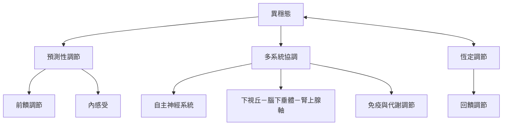

本地圖呈現異穩態的核心調節觀：恆定調節、回饋修正、前饋預測與神經內分泌系統並非互斥，而是在不同尺度協調身體。

```mermaid
flowchart TD
  A[異穩態] --> B[預測性調節]
  A --> C[多系統協調]
  B --> D[前饋調節]
  B --> E[內感受]
  C --> F[自主神經系統]
  C --> G[下視丘－腦下垂體－腎上腺軸]
  C --> H[免疫與代謝調節]
  A <--> I[恆定調節]
  I --> J[回饋調節]
```

- [[異穩態]]
- [[恆定調節]]
- [[前饋調節]]
- [[回饋調節]]
- [[內感受]]
- [[自主神經系統]]
- [[下視丘－腦下垂體－腎上腺軸]]
