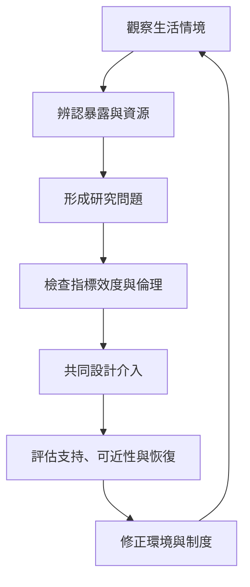

本地圖將研究證據轉成可檢驗的行動：先辨認生活暴露，再找資源與制度的可變項，最後以參與者共創和持續回饋評估，而非只追逐單一分數。

```mermaid
flowchart TD
  A[觀察生活情境] --> B[辨認暴露與資源]
  B --> C[形成研究問題]
  C --> D[檢查指標效度與倫理]
  D --> E[共同設計介入]
  E --> F[評估支持、可近性與恢復]
  F --> G[修正環境與制度]
  G --> A
```

- [[社會健康決定因素]]
- [[韌性]]
- [[異穩態負荷]]
- [[平等心]]
