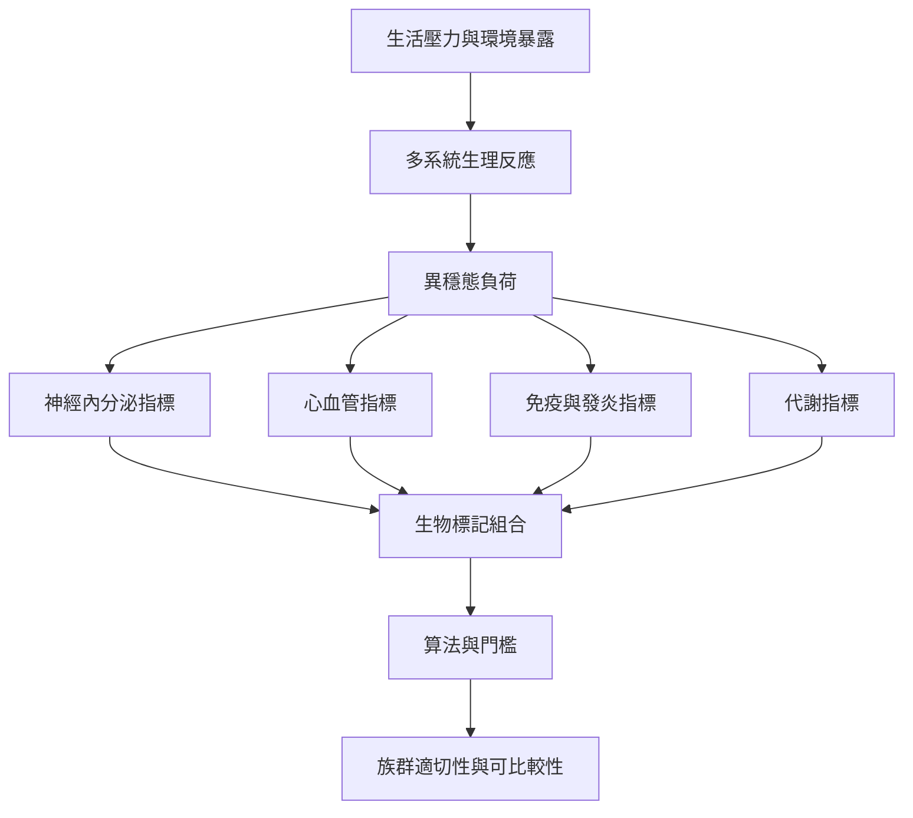

本地圖把異穩態負荷放在理論、暴露、系統指標與算法之間，並提醒研究者不要把綜合分數當作單一、普遍有效的壓力尺。

```mermaid
flowchart TD
  A[生活壓力與環境暴露] --> B[多系統生理反應]
  B --> C[異穩態負荷]
  C --> D[神經內分泌指標]
  C --> E[心血管指標]
  C --> F[免疫與發炎指標]
  C --> G[代謝指標]
  D --> H[生物標記組合]
  E --> H
  F --> H
  G --> H
  H --> I[算法與門檻]
  I --> J[族群適切性與可比較性]
```

- [[異穩態負荷]]
- [[生物標記]]
- [[皮質醇]]
- [[發炎反應]]
- [[心率變異度]]
