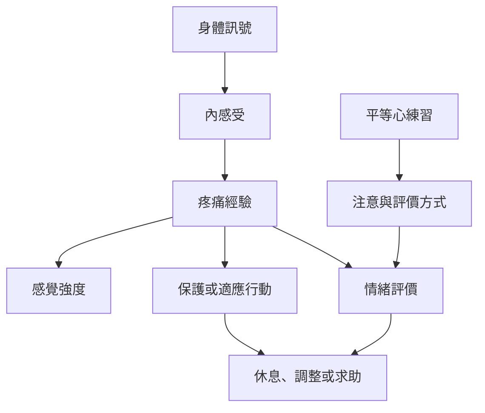

本地圖將疼痛的感覺、情緒評價、行動需求與內觀訓練分開；平等心可作為研究主觀反應的線索，但不應被誤當成醫療處置或生理負荷指標。

```mermaid
flowchart TD
  A[身體訊號] --> B[內感受]
  B --> C[疼痛經驗]
  C --> D[感覺強度]
  C --> E[情緒評價]
  C --> F[保護或適應行動]
  G[平等心練習] --> H[注意與評價方式]
  H --> E
  F --> I[休息、調整或求助]
  E --> I
```

- [[內感受]]
- [[疼痛]]
- [[平等心]]
- [[異穩態]]
- [[恆定調節]]
