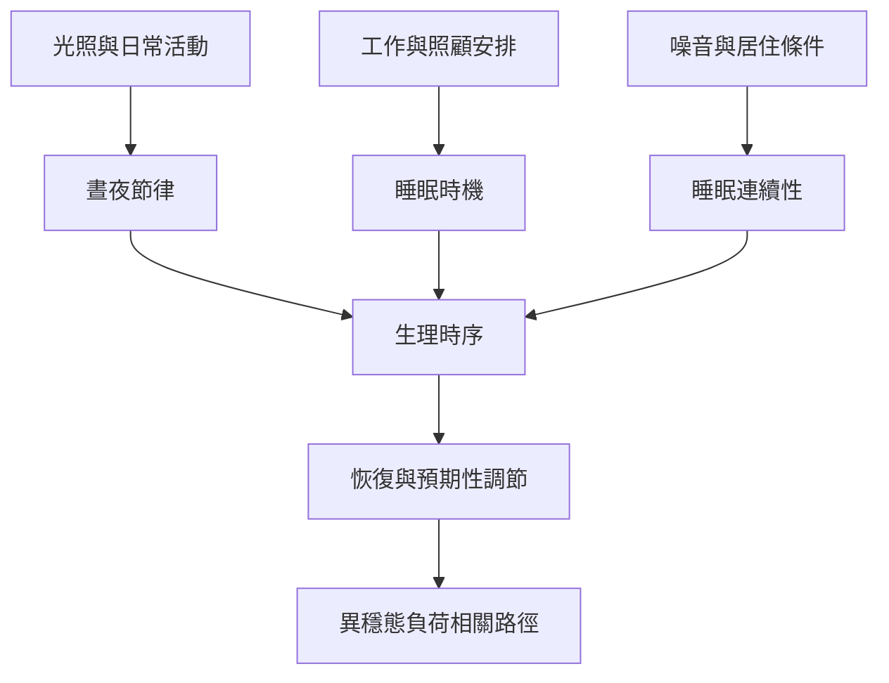

本地圖把睡眠與節律視為生活時序與環境條件的交會點，將工作、照顧、光照、噪音和恢復機會納入理解。

```mermaid
flowchart TD
  A[光照與日常活動] --> B[晝夜節律]
  C[工作與照顧安排] --> D[睡眠時機]
  E[噪音與居住條件] --> F[睡眠連續性]
  B --> G[生理時序]
  D --> G
  F --> G
  G --> H[恢復與預期性調節]
  H --> I[異穩態負荷相關路徑]
```

- [[晝夜節律]]
- [[異穩態負荷]]
- [[前饋調節]]
- [[韌性]]
