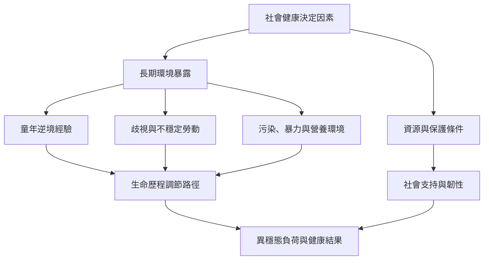

本地圖聚焦社會條件如何在生命歷程中持續影響生理調節。它將環境暴露與資源可近性並列，避免將健康差異完全個人化。

```mermaid
flowchart TD
  A[社會健康決定因素] --> B[長期環境暴露]
  A --> C[資源與保護條件]
  B --> D[童年逆境經驗]
  B --> E[歧視與不穩定勞動]
  B --> F[污染、暴力與營養環境]
  D --> G[生命歷程調節路徑]
  E --> G
  F --> G
  C --> H[社會支持與韌性]
  G --> I[異穩態負荷與健康結果]
  H --> I
```

- [[社會健康決定因素]]
- [[童年逆境經驗]]
- [[Weathering 假說]]
- [[生命歷程觀點]]
- [[韌性]]
