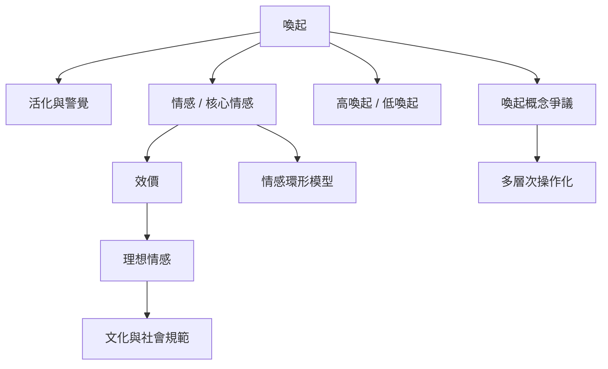

這張地圖從「喚起究竟指什麼」出發，連接情感維度、理想情緒、文化差異與概念爭議。閱讀時先理解效價—喚起模型的用途，再回到概念定義與建構情緒等批判視角。

```mermaid
flowchart TD
  A[喚起] --> B[活化與警覺]
  A --> C[情感 / 核心情感]
  C --> D[效價]
  C --> E[情感環形模型]
  D --> F[理想情感]
  A --> G[高喚起 / 低喚起]
  F --> H[文化與社會規範]
  A --> I[喚起概念爭議]
  I --> J[多層次操作化]
```

## 延伸筆記
- [[喚起不是單一可測量的身心總量]]
- [[效價與喚起是描述地圖而不是情緒的完整領土]]
- [[文化會塑造理想情緒而不只塑造情緒表達]]
- [[文化差異是群體趨勢不是個人本質]]
