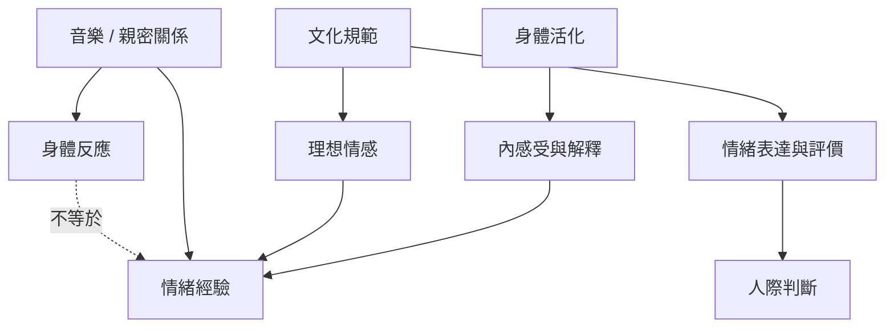

這張地圖將喚起放回情緒語言、文化理想、關係規範、音樂與性經驗中。重點是：生理反應不等於主觀經驗，文化差異也不能變成個人本質的刻板分類。

```mermaid
flowchart TD
  A[身體活化] --> B[內感受與解釋]
  B --> C[情緒經驗]
  D[文化規範] --> E[理想情感]
  D --> F[情緒表達與評價]
  E --> C
  F --> G[人際判斷]
  H[音樂 / 親密關係] --> C
  H --> I[身體反應]
  I -.不等於.-> C
```

## 延伸筆記
- [[文化會塑造理想情緒而不只塑造情緒表達]]
- [[身體反應不能取代對他人內在狀態的詢問]]
- [[音樂把情緒喚起轉化為可感知的身體地圖]]
- [[性喚起中的身體反應不等於主觀欲望或同意]]
