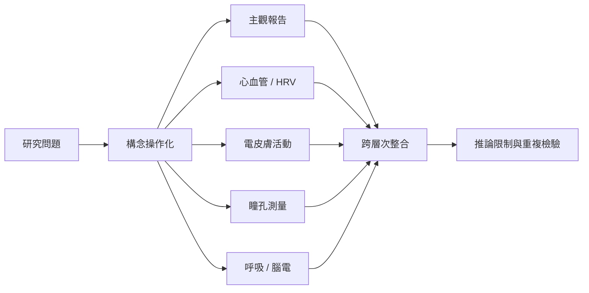

這張地圖從構念定義開始，連接內感受、自主神經、皮膚電、心率變異度與瞳孔測量。每個指標都只是某一生理過程的視窗；研究設計應先定義問題，再選擇測量方式與時間尺度。

```mermaid
flowchart LR
  A[研究問題] --> B[構念操作化]
  B --> C[主觀報告]
  B --> D[心血管 / HRV]
  B --> E[電皮膚活動]
  B --> F[瞳孔測量]
  B --> G[呼吸 / 腦電]
  C --> H[跨層次整合]
  D --> H
  E --> H
  F --> H
  G --> H
  H --> I[推論限制與重複檢驗]
```

## 延伸筆記
- [[喚起應區分神經生理主觀與行為層次]]
- [[測量指標必須對應明確假說]]
- [[身體訊號需要經內感受與情境解釋才成為情緒]]
