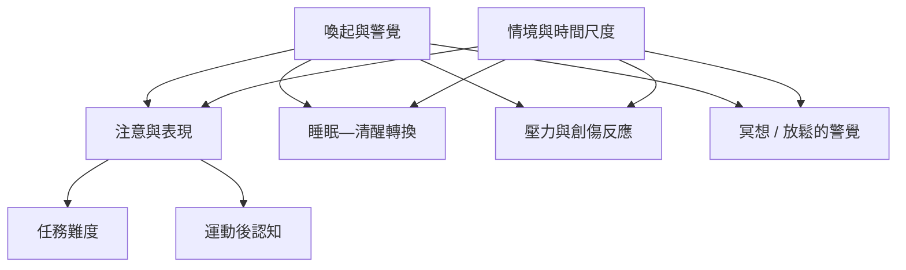

這張地圖整理喚起如何影響工作、運動、睡眠、創傷反應與冥想。核心不是找一個普遍最佳數值，而是分析任務、時間尺度、注意策略與恢復條件。

```mermaid
flowchart TD
  A[喚起與警覺] --> B[注意與表現]
  B --> C[任務難度]
  B --> D[運動後認知]
  A --> E[睡眠—清醒轉換]
  A --> F[壓力與創傷反應]
  A --> G[冥想 / 放鬆的警覺]
  H[情境與時間尺度] --> B
  H --> E
  H --> F
  H --> G
```

## 延伸筆記
- [[最佳活化程度取決於任務難度與注意策略]]
- [[運動的認知效益不等同於喚起越高越好]]
- [[創傷反應不能只用高喚起與低喚起二分解釋]]
- [[冥想可以呈現放鬆與警覺同時存在的狀態]]
