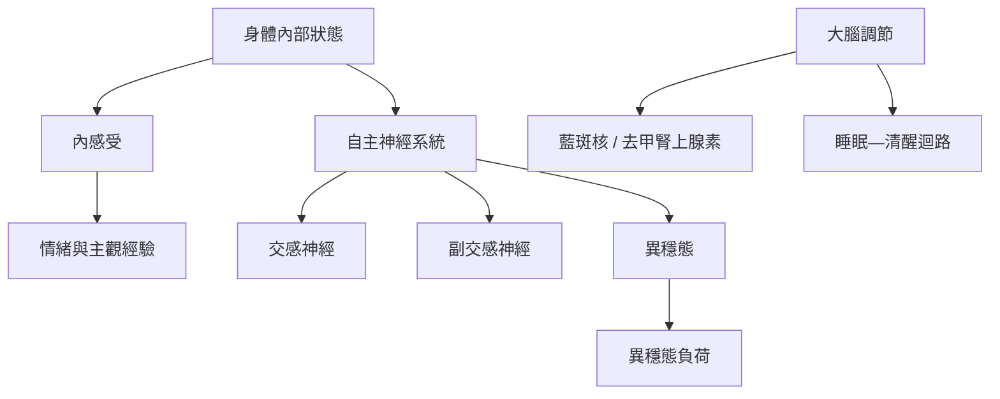

這張地圖聚焦身體如何感受內部訊號、維持適應、調整警覺，以及如何在短期動員與長期負荷之間轉換。不要將交感／副交感、心率或某個神經核團視為喚起的全部。

```mermaid
flowchart TD
  A[身體內部狀態] --> B[內感受]
  B --> C[情緒與主觀經驗]
  A --> D[自主神經系統]
  D --> E[交感神經]
  D --> F[副交感神經]
  G[大腦調節] --> H[藍斑核 / 去甲腎上腺素]
  G --> I[睡眠—清醒迴路]
  D --> J[異穩態]
  J --> K[異穩態負荷]
```

## 延伸筆記
- [[身體訊號需要經內感受與情境解釋才成為情緒]]
- [[交感與副交感不是簡單的身心翹翹板]]
- [[異穩態把短期適應與長期磨耗放在同一框架]]
- [[睡眠啟動是逐步降低外界警覺需求的過程]]
