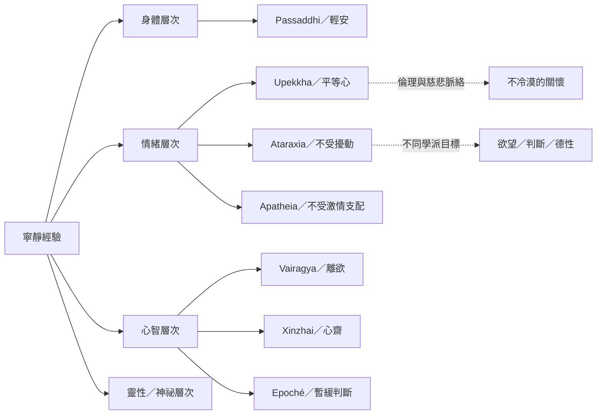

跨文化研究可先從經驗面向比較，再回到各傳統的倫理與形上脈絡。以下關係是研究導覽，不表示概念完全同義。

```mermaid
flowchart LR
    T[寧靜經驗]
    T --> B[身體層次]
    T --> F[情緒層次]
    T --> M[心智層次]
    T --> X[靈性／神祕層次]
    B --> P[Passaddhi／輕安]
    F --> U[Upekkha／平等心]
    F --> A[Ataraxia／不受擾動]
    F --> AP[Apatheia／不受激情支配]
    M --> V[Vairagya／離欲]
    M --> XZ[Xinzhai／心齋]
    M --> EP[Epoché／暫緩判斷]
    U -.倫理與慈悲脈絡.-> C[不冷漠的關懷]
    A -.不同學派目標.-> D[欲望／判斷／德性]
```

研究者提出臨在感、內在平和、抽離與投入等可能共通特徵，但也提醒跨文化比較受知識範圍與翻譯限制。可接續閱讀 [[不同傳統的平靜經驗可比較但不能互相化約]]、[[寧靜的身體情緒與心智需要分開觀察]] 與 [[東西方傳統的寧靜經驗共享臨在與內在平和但保留文化差異]]。
