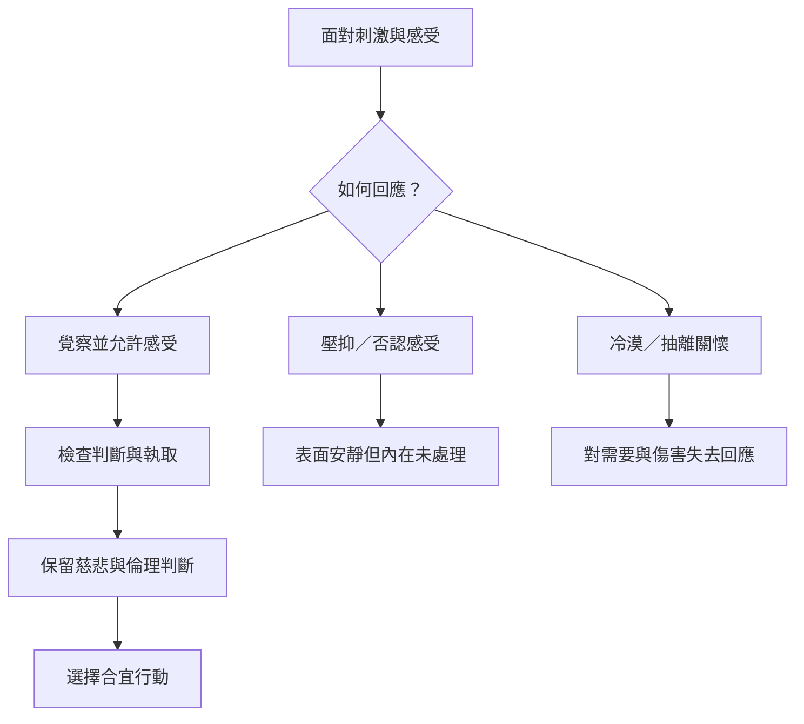

心靈安寧需要保留覺察、情感辨識、倫理關懷與行動能力。若一種「平靜」使人否認痛苦、逃避責任或對他人受苦無動於衷，就必須重新檢查它究竟是平等心、情緒壓抑，還是冷漠。

```mermaid
flowchart TD
    A[面對刺激與感受]
    A --> B{如何回應？}
    B --> C[覺察並允許感受]
    C --> D[檢查判斷與執取]
    D --> E[保留慈悲與倫理判斷]
    E --> F[選擇合宜行動]
    B --> G[壓抑／否認感受]
    G --> H[表面安靜但內在未處理]
    B --> I[冷漠／抽離關懷]
    I --> J[對需要與傷害失去回應]
```

「不被情緒控制」與「不允許情緒存在」是不同的。延伸閱讀 [[平等心保留感受與慈悲而不被偏愛厭惡牽引]]、[[平靜不能等同冷漠麻木或逃避現實]] 與 [[佛教平等心不是冷漠而是不黏著的覺察]]。
