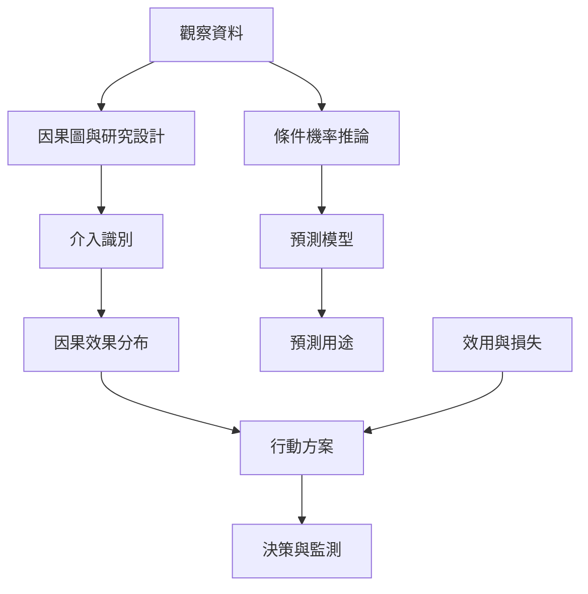

貝葉斯網路能表示機率依賴結構，後驗預測能估計觀察結果，但因果決策需要額外的介入語意與識別假設。推論、因果、行動與價值應在圖上清楚分層。

```mermaid
flowchart TD
  A[觀察資料] --> B[條件機率推論]
  B --> C[預測模型]
  D[因果圖與研究設計] --> E[介入識別]
  A --> D
  E --> F[因果效果分布]
  C --> G[預測用途]
  F --> H[行動方案]
  I[效用與損失] --> H
  H --> J[決策與監測]
```

延伸概念：[[貝葉斯網路]]、[[因果推論]]、[[條件機率與介入機率回答的是不同問題]]、[[推論與決策必須分開：後驗機率不會自動決定行動]]、[[貝葉斯決策理論]]。
