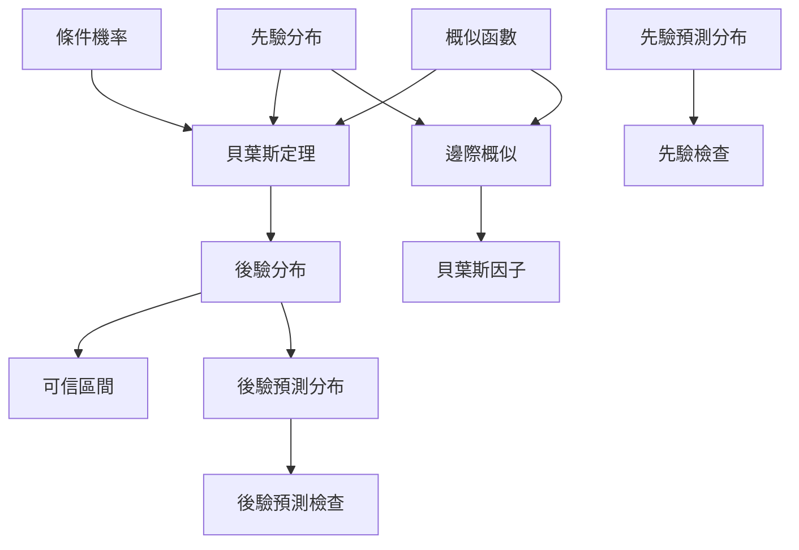

貝葉斯推論的數學主幹是由條件機率把先驗、概似與資料證據整合成後驗，再由後驗推導參數區間與未來觀察的預測分布。這張圖適合從公式與基本概念開始閱讀。

```mermaid
flowchart TD
  A[條件機率] --> B[貝葉斯定理]
  C[先驗分布] --> B
  D[概似函數] --> B
  B --> E[後驗分布]
  D --> F[邊際概似]
  C --> F
  F --> G[貝葉斯因子]
  E --> H[可信區間]
  E --> I[後驗預測分布]
  J[先驗預測分布] --> K[先驗檢查]
  I --> L[後驗預測檢查]
```

延伸概念：[[貝葉斯推論]]、[[貝葉斯定理]]、[[先驗分布]]、[[概似函數]]、[[後驗分布]]、[[邊際概似]]、[[貝葉斯因子]]、[[可信區間]]、[[先驗預測分布]]、[[後驗預測檢查]]。
