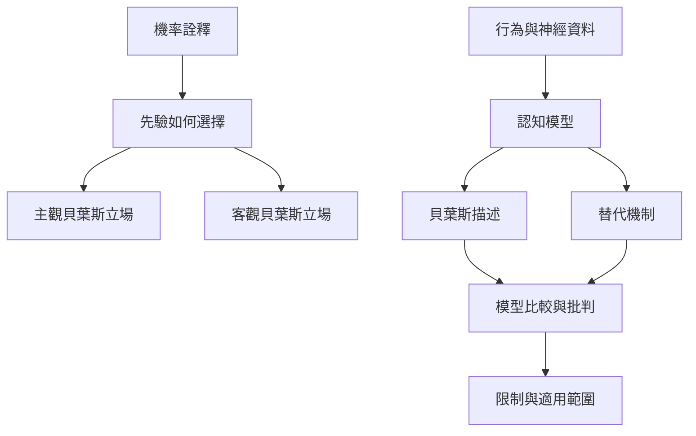

貝葉斯方法同時是一套數學更新規則、一種機率詮釋與一種科學建模實作。主觀與客觀貝葉斯主義對先驗限制有不同立場；認知科學中的「貝葉斯腦」則是模型解釋，不應直接等同大腦必然使用的演算法。

```mermaid
flowchart TD
  A[機率詮釋] --> B[先驗如何選擇]
  B --> C[主觀貝葉斯立場]
  B --> D[客觀貝葉斯立場]
  E[行為與神經資料] --> F[認知模型]
  F --> G[貝葉斯描述]
  F --> H[替代機制]
  G --> I[模型比較與批判]
  H --> I
  I --> J[限制與適用範圍]
```

延伸概念：[[貝葉斯方法的分歧源於機率究竟描述世界還是知識]]、[[認知上的貝葉斯描述是模型層次而非大腦必然採用的演算法]]、[[貝葉斯推論的確定性受限於候選模型空間]]。
