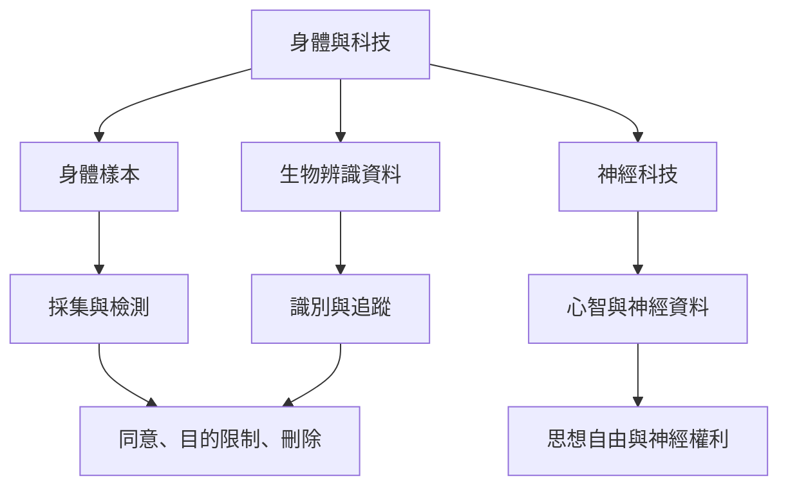

身體樣本、生物辨識與神經科技正在改變身體完整性的邊界。資料不只是身體的替代品，也可能被用來推斷健康、身份、情緒與意圖；因此治理必須涵蓋資料生命週期與心智隱私。

```mermaid
flowchart TD
  A[身體與科技] --> B[身體樣本]
  A --> C[生物辨識資料]
  A --> D[神經科技]
  B --> E[採集與檢測]
  C --> F[識別與追蹤]
  D --> G[心智與神經資料]
  E --> H[同意、目的限制、刪除]
  F --> H
  G --> I[思想自由與神經權利]
```

**雙向連結**：[[身體樣本]]、[[資訊隱私]]、[[神經權利]]、[[身體樣本是身體完整性與資訊隱私的交界]]、[[神經科技使身體完整性延伸至心智與神經資料]]、[[身體資料治理需要預防推論與用途漂移]]
