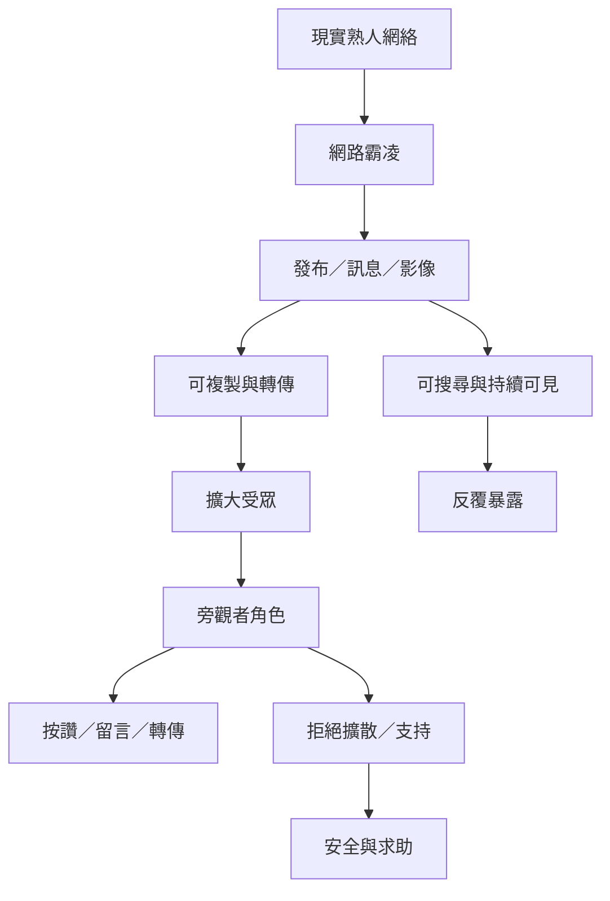

網路霸凌讓傷害內容可能被保存、轉傳、搜尋和再次呈現，且線上互動常與現實熟人網絡連結。防治需同時處理內容、平台、群體回饋和當事人安全。

```mermaid
flowchart TD
 A[網路霸凌] --> B[發布／訊息／影像]
 B --> C[可複製與轉傳]
 B --> D[可搜尋與持續可見]
 C --> E[擴大受眾]
 D --> F[反覆暴露]
 G[現實熟人網絡] --> A
 E --> H[旁觀者角色]
 H --> I[按讚／留言／轉傳]
 H --> J[拒絕擴散／支持]
 J --> K[安全與求助]
```

連結[[網路霸凌]]、[[重複性]]、[[旁觀者角色]]、[[防衛者]]及[[心理安全]]。數位處置不應只要求受害者退出平台。
