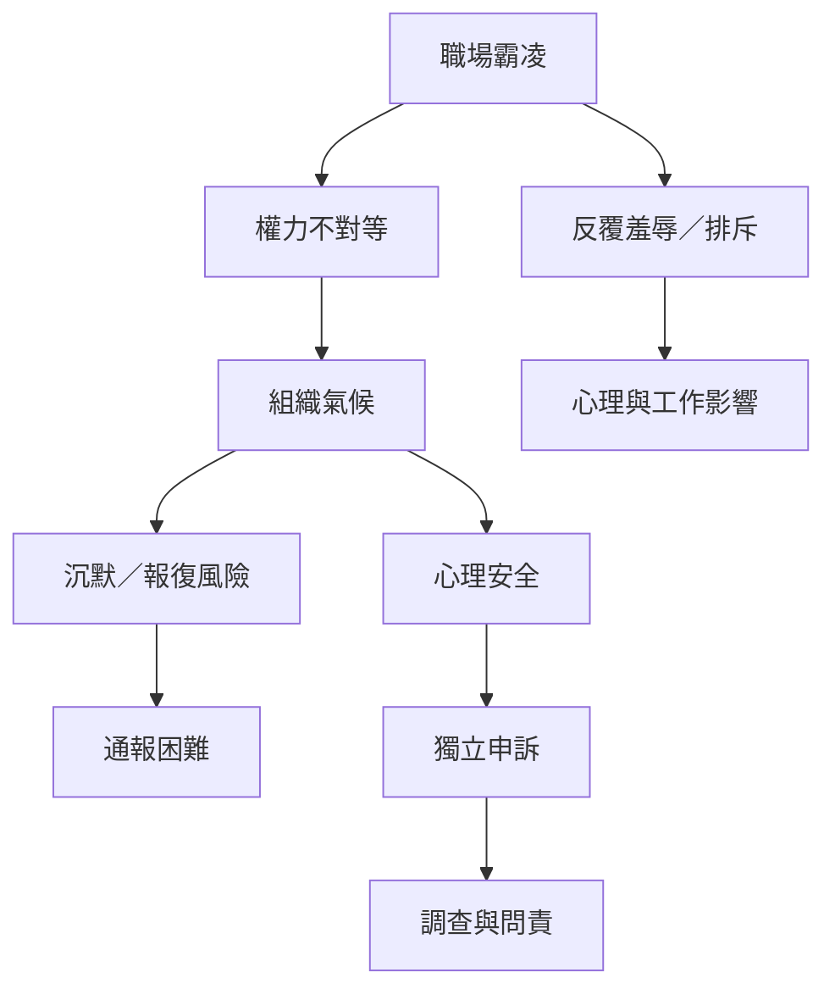

職場霸凌不是單純的人際摩擦，而是可能由權力、資源依賴、組織文化與沉默共同維持的工作傷害。安全治理需要獨立申訴、反報復與持續檢視組織氣候。

```mermaid
flowchart TD
 A[職場霸凌] --> B[權力不對等]
 A --> C[反覆羞辱／排斥]
 B --> D[組織氣候]
 C --> E[心理與工作影響]
 D --> F[沉默／報復風險]
 D --> G[心理安全]
 F --> H[通報困難]
 G --> I[獨立申訴]
 I --> J[調查與問責]
```

連結[[職場霸凌]]、[[職場集體排擠]]、[[權力不對等]]、[[組織氣候]]、[[心理安全]]及[[程序正義]]。
