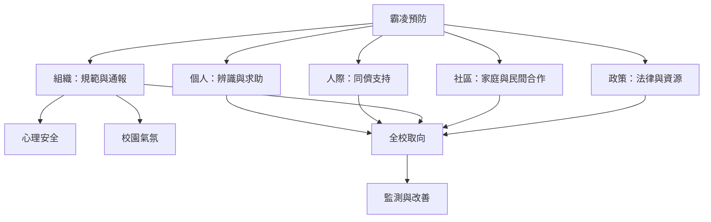

預防需要從個人互動擴展到家庭、校園、職場、社區和政策制度。治理品質取決於責任分工、資源、通報安全、執行能力與長期評估。

```mermaid
flowchart TD
 A[霸凌預防] --> B[個人：辨識與求助]
 A --> C[人際：同儕支持]
 A --> D[組織：規範與通報]
 A --> E[社區：家庭與民間合作]
 A --> F[政策：法律與資源]
 D --> G[心理安全]
 D --> H[校園氣氛]
 B --> I[全校取向]
 C --> I
 D --> I
 E --> I
 F --> I
 I --> J[監測與改善]
```

連結[[社會生態模型]]、[[全校取向]]、[[霸凌預防]]、[[校園氣氛]]、[[程序正義]]及[[組織氣候]]。跨國政策移植要保留地方脈絡。
