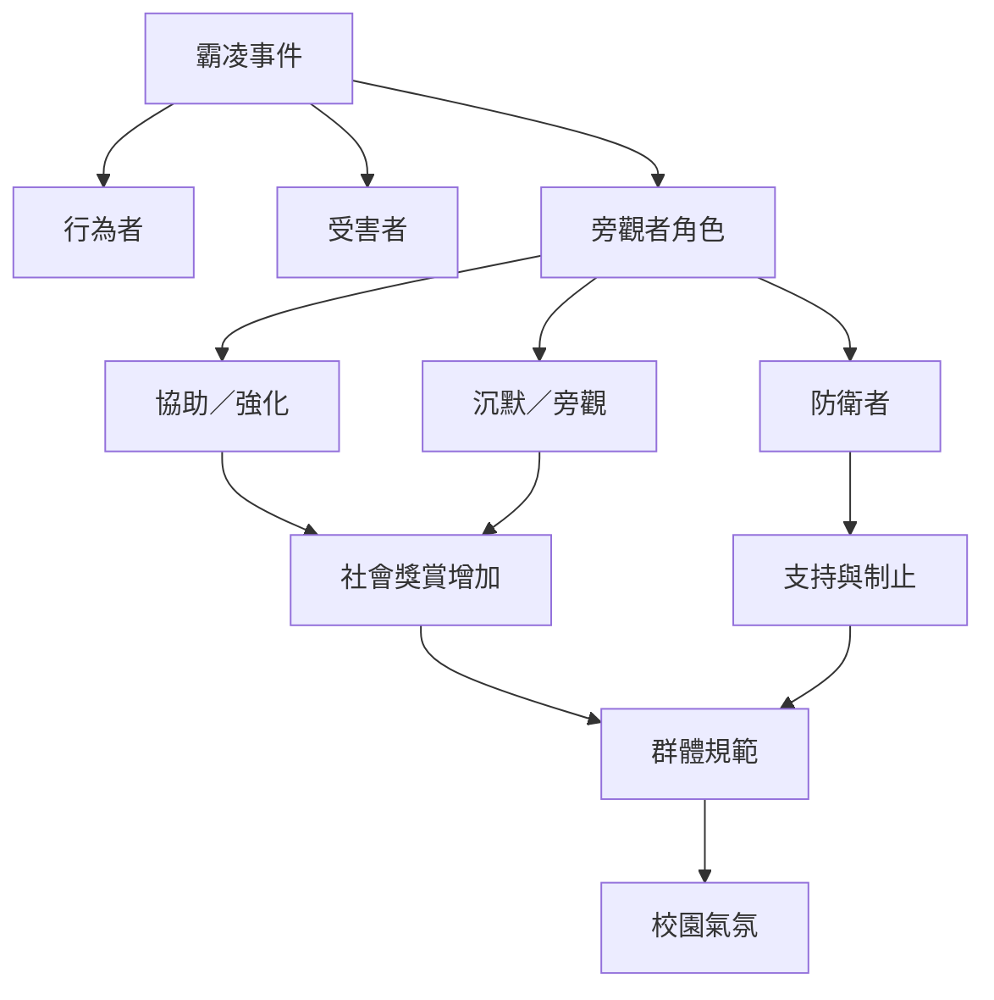

霸凌透過群體關係維持。旁觀者、協助者、強化者和防衛者會影響行為是否獲得注意、地位與默許；群體規範與校園氣氛則構成更大的環境。

```mermaid
flowchart TD
 A[霸凌事件] --> B[行為者]
 A --> C[受害者]
 A --> D[旁觀者角色]
 D --> E[協助／強化]
 D --> F[沉默／旁觀]
 D --> G[防衛者]
 E --> H[社會獎賞增加]
 F --> H
 G --> I[支持與制止]
 H --> J[群體規範]
 I --> J
 J --> K[校園氣氛]
```

連結[[旁觀者角色]]、[[旁觀者效應]]、[[防衛者]]、[[校園氣氛]]、[[霸凌預防]]及[[全校取向]]。群體分析的重點不是把所有旁觀者道德化，而是設計安全且可實踐的支持行動。
