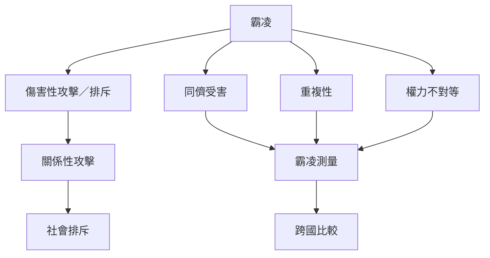

霸凌的核心判斷涉及傷害、權力不對等與重複性，但不同研究和法規對要件的操作方式並不一致。概念地圖將定義、受害、攻擊形式與測量連起來，提醒研究者先描述行為，再說明是否符合特定定義。

```mermaid
flowchart TD
 A[霸凌] --> B[傷害性攻擊／排斥]
 A --> C[權力不對等]
 A --> D[重複性]
 B --> E[關係性攻擊]
 E --> F[社會排斥]
 A --> G[同儕受害]
 G --> H[霸凌測量]
 D --> H
 C --> H
 H --> I[跨國比較]
```

可從[[霸凌]]、[[權力不對等]]、[[重複性]]與[[霸凌測量]]進入，再延伸到[[同儕受害]]、[[關係性攻擊]]和[[社會排斥]]。研究上的定義不可取代實務上的即時保護。
