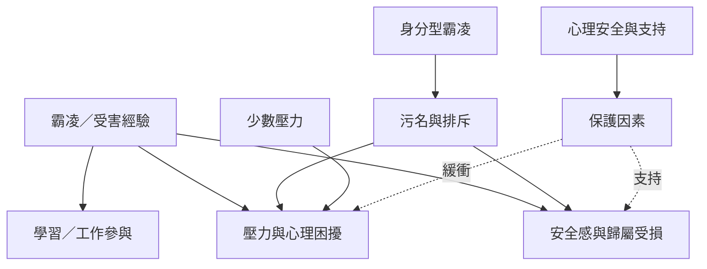

霸凌可能影響安全感、歸屬、心理健康與學習參與；若攻擊針對身分特徵，個人受害會與社會偏見交疊。分析應同時看個人經驗、支持資源和制度環境，不將受害者風險當成個人缺陷。

```mermaid
flowchart TD
 A[霸凌／受害經驗] --> B[安全感與歸屬受損]
 A --> C[壓力與心理困擾]
 A --> D[學習／工作參與]
 E[身分型霸凌] --> F[污名與排斥]
 F --> B
 F --> C
 G[少數壓力] --> C
 H[心理安全與支持] --> I[保護因素]
 I -.緩衝.-> C
 I -.支持.-> B
```

連結[[身分型霸凌]]、[[少數壓力]]、[[心理安全]]、[[同儕受害]]與[[社會排斥]]。研究後果時要分清關聯、因果與個人差異。
