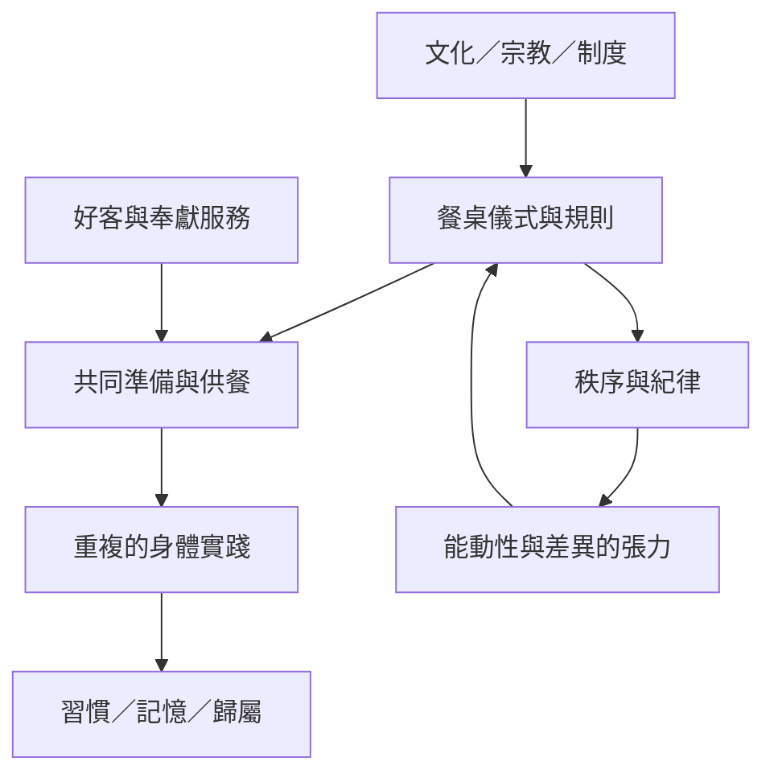

宗教、節慶、學校與家庭的共餐，透過重複儀式把價值觀與行為模式變成身體習慣；但儀式也可能成為規訓或排除機制。

```mermaid
flowchart TD
  A[文化／宗教／制度] --> B[餐桌儀式與規則]
  B --> C[共同準備與供餐]
  C --> D[重複的身體實踐]
  D --> E[習慣／記憶／歸屬]
  B --> F[秩序與紀律]
  F --> G[能動性與差異的張力]
  G --> B
  H[好客與奉獻服務] --> C
```

概念連結：[[朗加爾 Langar]]、[[奉獻服務 Seva]]、[[宴饗 Feasting]]、[[共食的重複節奏能培養集體習慣]]、[[共餐規則決定參與者能否自在]]、[[共食設計必須尊重參與者的能動性與差異]]。

知識書導讀：[[Communal_meal]]
