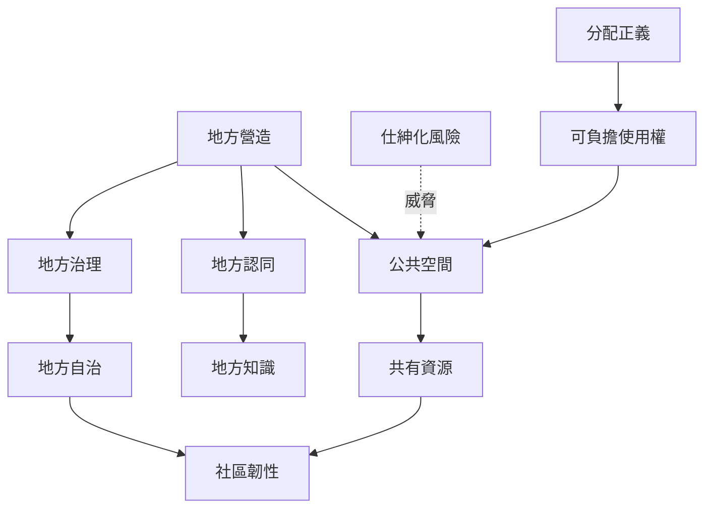

[[地方營造]]將空間、文化、生活與治理結合；它要與[[地方發展]]及[[社區韌性]]相互連結。居民的[[地方知識]]能辨識日常需求與風險，但空間改善若忽略可負擔性，可能引發排除。長期維護、可使用權與公共服務是地方營造可持續的條件。

```mermaid
flowchart TD
 A[地方營造] --> B[公共空間]
 A --> C[地方認同]
 A --> D[地方治理]
 B --> E[共有資源]
 D --> F[地方自治]
 C --> G[地方知識]
 E --> H[社區韌性]
 F --> H
 I[仕紳化風險] -.威脅.-> B
 J[分配正義] --> K[可負擔使用權]
 K --> B
```

建議閱讀：[[地方營造必須建立長期維護與居民治理能力]]、[[社區韌性不是要求居民獨自承受危機]]、[[以小型公共實驗測試社區提案再決定是否擴大]]。
