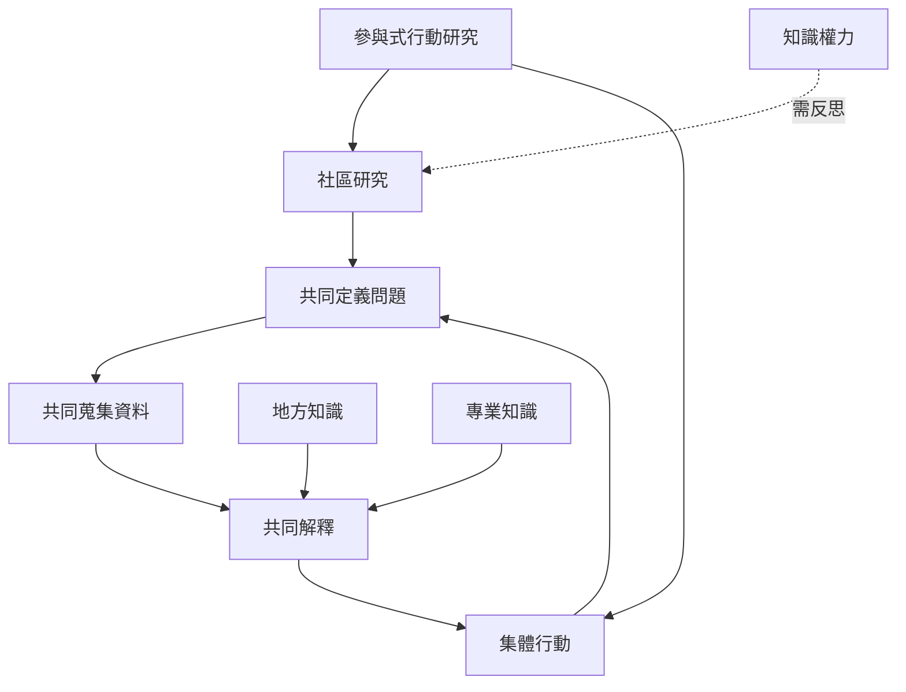

社區研究的價值不只在取得資料，也在居民能否共同定義問題、解釋經驗並決定知識用途。[[參與式行動研究]]連結[[地方知識]]與[[社區增能]]，並可透過共同生產建立研究與公共行動之間的循環。研究倫理必須處理資料控制、署名、匿名與成果回饋。

```mermaid
flowchart TD
 A[社區研究] --> B[共同定義問題]
 B --> C[共同蒐集資料]
 C --> D[共同解釋]
 D --> E[集體行動]
 E --> B
 F[地方知識] --> D
 G[專業知識] --> D
 H[參與式行動研究] --> A
 H --> E
 I[知識權力] -.需反思.-> A
```

建議閱讀：[[社區研究應由居民共同定義問題與知識用途]]、[[建立由居民共同擁有資料與研究成果的社區研究共同體]]。
