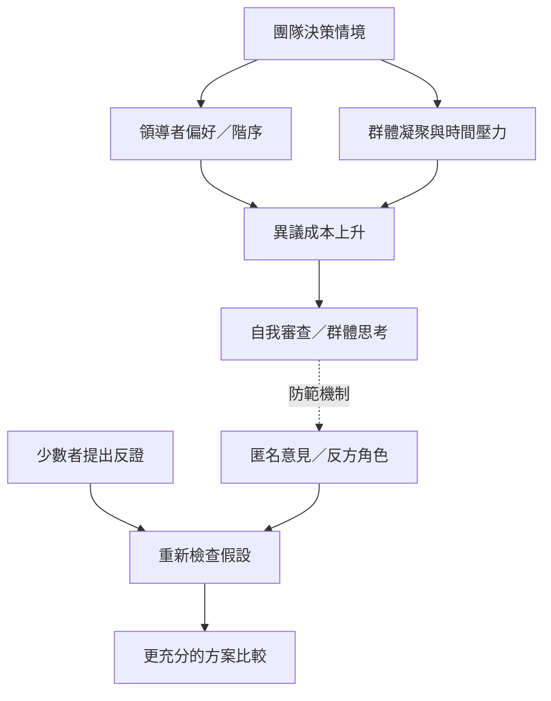

群體不只有多數壓力，也有少數者轉化、群體思考與制度化的異議空間。關鍵是把異議設計成團隊流程。

```mermaid
flowchart TD
  A[團隊決策情境] --> B[領導者偏好／階序]
  A --> C[群體凝聚與時間壓力]
  B --> D[異議成本上升]
  C --> D
  D --> E[自我審查／群體思考]
  F[少數者提出反證] --> G[重新檢查假設]
  H[匿名意見／反方角色] --> G
  G --> I[更充分的方案比較]
  E -.防範機制.-> H
```

概念連結：[[群體思考]]、[[少數者影響]]、[[公開順從]]、[[社會認同]]、[[社會規範]]、[[從眾]]。

延伸閱讀：[[從眾是群體影響下的態度或行為調整而非單一人格特質]]、[[少數者持續提出異議能擴張群體可思考的範圍]]、[[改變有害規範必須同時處理期待權力與物質條件]]。
