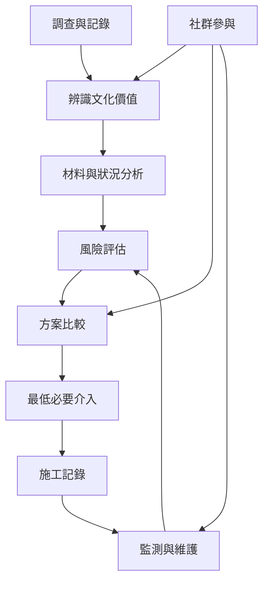

保存介入應從調查與記錄開始，辨識材料狀況與文化意義，再比較風險與方案，採取必要措施，並透過監測與維護形成循環。修復不是流程的終點，而是長期照護的一部分。

```mermaid
flowchart TD
  A[調查與記錄] --> B[辨識文化價值]
  B --> C[材料與狀況分析]
  C --> D[風險評估]
  D --> E[方案比較]
  E --> F[最低必要介入]
  F --> G[施工記錄]
  G --> H[監測與維護]
  H --> D
  I[社群參與] --> B
  I --> E
  I --> H
```

雙向連結：[[保存]]、[[修復]]、[[最低干預]]、[[預防性保存]]、[[記錄]]、[[相容性]]、[[風險管理]]。
