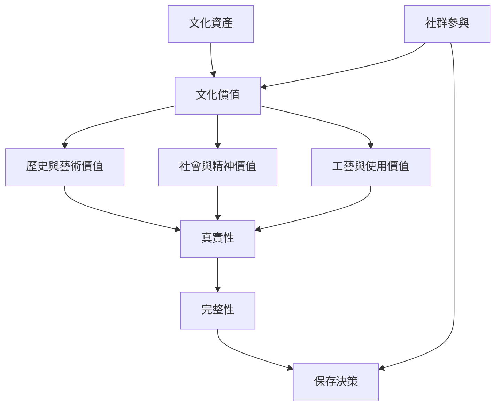

文化資產的價值先於具體修復方案；真實性與完整性則是理解價值是否仍能被證據支持的判斷。不同文化群體可能以不同材料、技藝、用途與記憶理解同一場所，因此需要透明的協商。

```mermaid
flowchart TD
  A[文化資產] --> B[文化價值]
  B --> C[歷史與藝術價值]
  B --> D[社會與精神價值]
  B --> E[工藝與使用價值]
  C --> F[真實性]
  D --> F
  E --> F
  F --> G[完整性]
  G --> H[保存決策]
  I[社群參與] --> B
  I --> H
```

雙向連結：[[文化資產]]、[[文化價值]]、[[真實性]]、[[完整性]]、[[文化意義]]、[[社群參與]]、[[文化資產保存首先要辨認價值而不是先決定修復方案]]。
