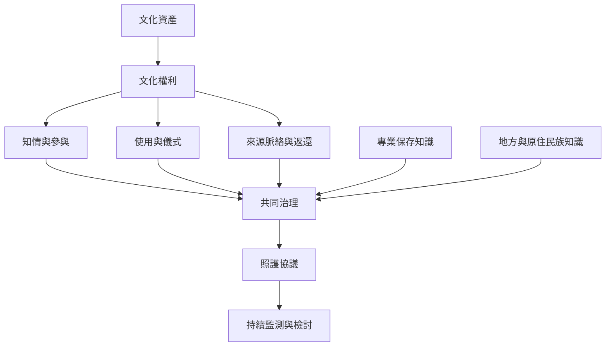

文化資產管理牽涉的不只是專家如何處置物件，也包括誰有權定義價值、使用場所、接觸資料、決定照護方式與要求返還。社群參與應從最早期的價值辨識開始，並延伸到日常管理。

```mermaid
flowchart TD
  A[文化資產] --> B[文化權利]
  B --> C[知情與參與]
  B --> D[使用與儀式]
  B --> E[來源脈絡與返還]
  C --> F[共同治理]
  D --> F
  E --> F
  F --> G[照護協議]
  G --> H[持續監測與檢討]
  I[專業保存知識] --> F
  J[地方與原住民族知識] --> F
```

雙向連結：[[原住民族文化權利]]、[[文化財返還]]、[[社群參與]]、[[來源脈絡]]、[[保存與展示的界線取決於物件是否仍能被社群使用]]。
