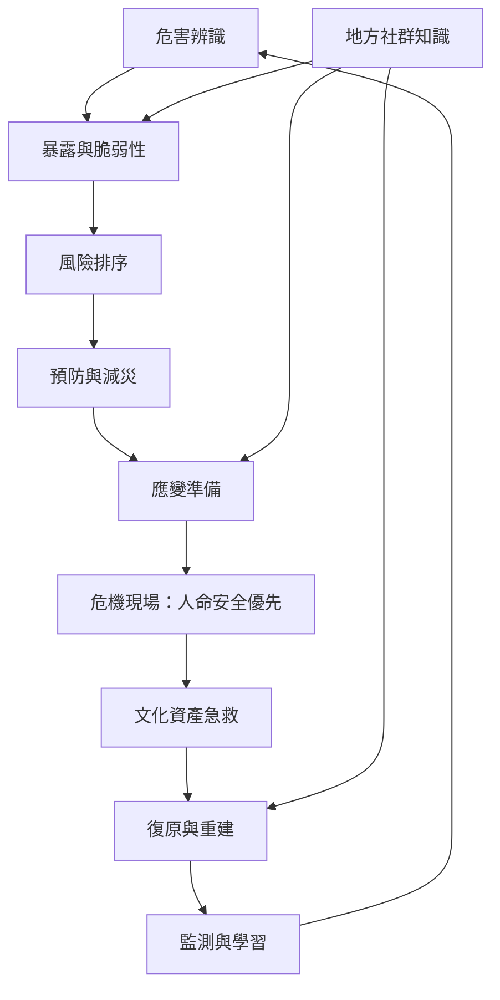

災害與氣候風險管理需要從平時準備開始，並把文化資產納入地方整體韌性。人命安全優先，但文化資產急救、地方知識與災後復原可以在事先規劃下同步進行。

```mermaid
flowchart TD
  A[危害辨識] --> B[暴露與脆弱性]
  B --> C[風險排序]
  C --> D[預防與減災]
  D --> E[應變準備]
  E --> F[危機現場：人命安全優先]
  F --> G[文化資產急救]
  G --> H[復原與重建]
  H --> I[監測與學習]
  I --> A
  J[地方社群知識] --> B
  J --> E
  J --> H
```

雙向連結：[[風險管理]]、[[災害風險管理]]、[[氣候風險]]、[[預防性保存]]、[[災害修復應先救人和穩定現場再處理物件]]、[[氣候變遷要求從固定環境標準轉向風險適應管理]]。
