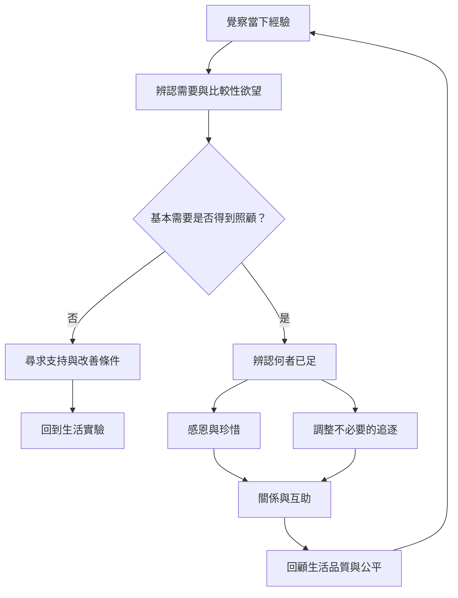

本圖把知足看成由覺察、辨認、選擇、互助與回顧組成的循環。它不是一次完成的個人成長專案，而是持續調整生活方式的過程；個人練習應與實際支持和公共條件同行。

```mermaid
flowchart TD
    A[覺察當下經驗] --> B[辨認需要與比較性欲望]
    B --> C{基本需要是否得到照顧？}
    C -->|否| D[尋求支持與改善條件]
    C -->|是| E[辨認何者已足]
    D --> F[回到生活實驗]
    E --> G[感恩與珍惜]
    E --> H[調整不必要的追逐]
    G --> I[關係與互助]
    H --> I
    I --> J[回顧生活品質與公平]
    J --> A
```

實作可從 [[用一張足夠地圖辨認生活中真正重要的需要]]、[[進行七天的足夠感觀察而不急著改變生活]]、[[在靜坐中練習辨認喜惡而不把知足變成命令]] 與 [[建立共享工具與續食餐桌讓知足成為共同實踐]] 開始。
