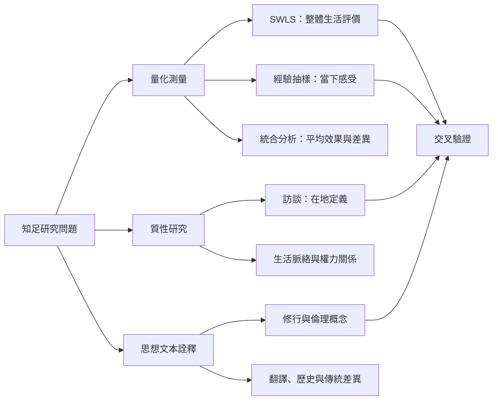

研究知足時，最重要的工作之一是避免概念混淆。不同方法回答不同問題：量表描述整體生活評價，經驗抽樣捕捉即時感受，質性訪談呈現文化意義，哲學與宗教文本則揭示價值脈絡。它們彼此補充，不宜互相取代。

```mermaid
flowchart LR
    A[知足研究問題] --> B[量化測量]
    A --> C[質性研究]
    A --> D[思想文本詮釋]
    B --> B1[SWLS：整體生活評價]
    B --> B2[經驗抽樣：當下感受]
    B --> B3[統合分析：平均效果與差異]
    C --> C1[訪談：在地定義]
    C --> C2[生活脈絡與權力關係]
    D --> D1[修行與倫理概念]
    D --> D2[翻譯、歷史與傳統差異]
    B1 --> E[交叉驗證]
    B2 --> E
    C1 --> E
    D1 --> E
```

延伸閱讀 [[知足需要明確定義才能被研究]]、[[美好生活不能只用個人感受或國家排名衡量]]、[[世界思想傳統中的知足與好生活地圖]]。
