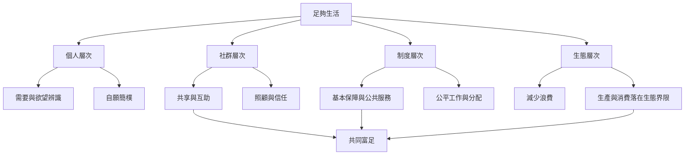

知足若要成為可持續的生活方式，需要把個人消費、企業生產、公共制度、社群互助與生態限度放在同一個系統理解。個人簡樸不能代替公平制度；共同富足也不代表忽略個人自主。

```mermaid
flowchart TD
    A[足夠生活]
    A --> B[個人層次]
    B --> B1[需要與欲望辨識]
    B --> B2[自願簡樸]
    A --> C[社群層次]
    C --> C1[共享與互助]
    C --> C2[照顧與信任]
    A --> D[制度層次]
    D --> D1[基本保障與公共服務]
    D --> D2[公平工作與分配]
    A --> E[生態層次]
    E --> E1[減少浪費]
    E --> E2[生產與消費落在生態界限]
    C1 --> F[共同富足]
    D1 --> F
    E2 --> F
```

延伸閱讀 [[足夠性必須同時改變消費與生產]]、[[自願簡樸與被迫匱乏必須區分]]、[[知足需要與公平和資源分配一起討論]]、[[共同富足不同於個人自足]]。
