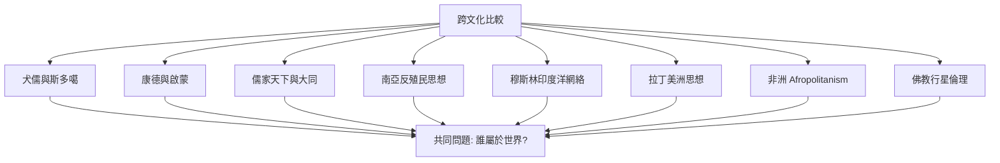

跨文化比較的目標不是證明所有文明早已共享同一套世界主義，而是讓不同傳統互相提問。比較時可觀察道德共同體從何開始、個人與群體的關係如何理解、政治秩序是否容納差異，以及普遍規範如何避免被帝國或文化中心挪用。

```mermaid
graph TD
  A[跨文化比較] --> B[犬儒與斯多噶]
  A --> C[康德與啟蒙]
  A --> D[儒家天下與大同]
  A --> E[南亞反殖民思想]
  A --> F[穆斯林印度洋網絡]
  A --> G[拉丁美洲思想]
  A --> H[非洲 Afropolitanism]
  A --> I[佛教行星倫理]
  B --> J[共同問題: 誰屬於世界?]
  C --> J
  D --> J
  E --> J
  F --> J
  G --> J
  H --> J
  I --> J
```

相關概念：[[世界公民]]、[[斯多噶世界公民觀]]、[[天下]]、[[大同]]、[[次屬世界主義]]、[[Afropolitanism]]、[[行星倫理]]、[[交談倫理]]。
