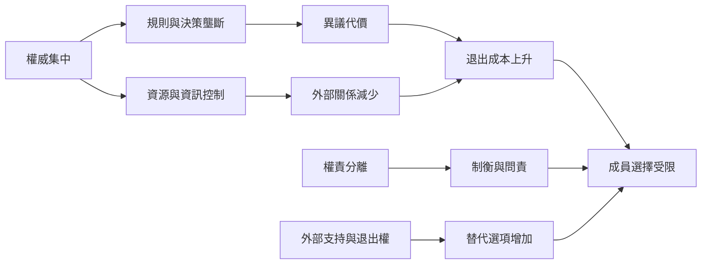

這張圖把高控制分析整理成資源與權力關係：當領袖同時掌握資源、規則、懲罰與申訴時，成員更難保有替代選項。

```mermaid
flowchart LR
  A[權威集中] --> B[規則與決策壟斷]
  A --> C[資源與資訊控制]
  B --> D[異議代價]
  C --> E[外部關係減少]
  D --> F[退出成本上升]
  E --> F
  F --> G[成員選擇受限]
  H[權責分離] --> I[制衡與問責]
  J[外部支持與退出權] --> K[替代選項增加]
  I --> G
  K --> G
```

推薦連結：[[高控制團體透過累積性控制縮窄成員選擇]]、[[魅力型權威若缺乏制衡容易演變成個人統治]]、[[用「權力與資源流向圖」發現社群中不易察覺的依賴]]、[[建立一份不以宗教身份為前提的社群健康檢核表]]。

總導讀：[[Cult]]。
