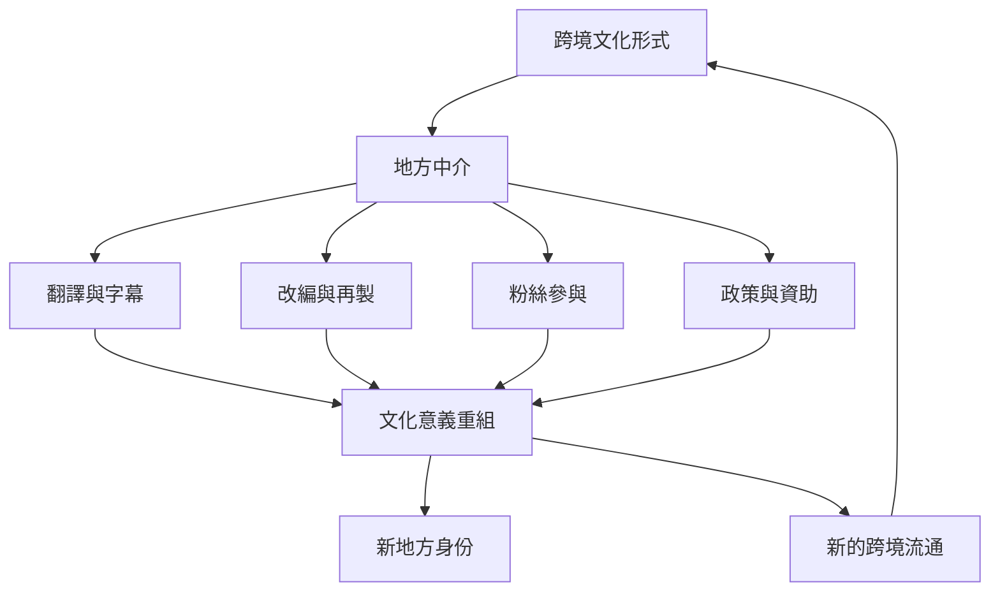

全球形式抵達地方後，會經過制度、語言、產業與受眾重新詮釋。此圖聚焦地方化不是單向接受，而是互構、翻譯和再生產。

```mermaid
flowchart TD
  A[跨境文化形式] --> B[地方中介]
  B --> C[翻譯與字幕]
  B --> D[改編與再製]
  B --> E[粉絲參與]
  B --> F[政策與資助]
  C --> G[文化意義重組]
  D --> G
  E --> G
  F --> G
  G --> H[新地方身份]
  G --> I[新的跨境流通]
  I --> A
```

## 概念連結
* [[全球在地化]]、[[文化翻譯]]、[[文化親近性]]、[[參與式文化]]、[[文化混融]]、[[韓流在地化是持續協商身份與語言意義的過程]]、[[比利時改編拉丁美洲肥皂劇顯示全球格式會被重寫為地方類型]]
