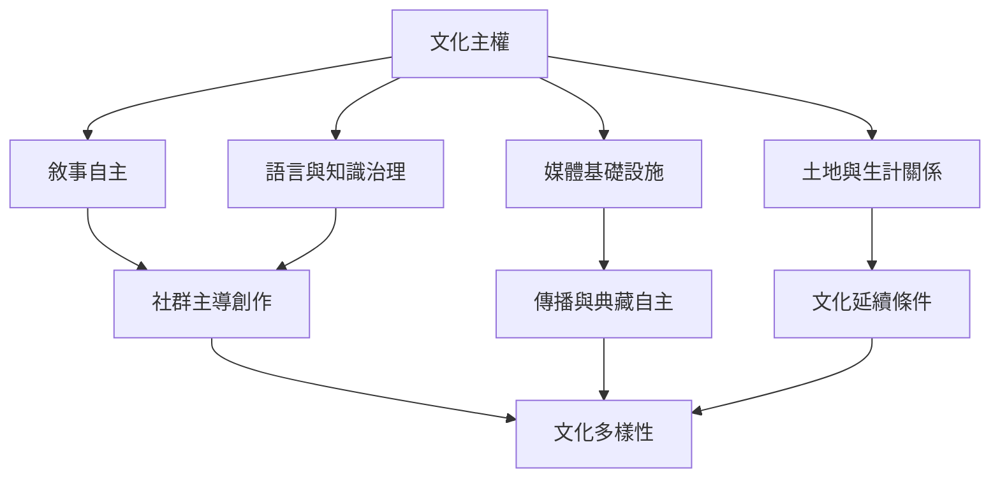

原住民文化主體性不只在於內容被呈現，也涉及社群是否掌握敘事、語言、資料與媒體基礎設施。

```mermaid
flowchart TD
  A[文化主權] --> B[敘事自主]
  A --> C[語言與知識治理]
  A --> D[媒體基礎設施]
  A --> E[土地與生計關係]
  B --> F[社群主導創作]
  C --> F
  D --> G[傳播與典藏自主]
  E --> H[文化延續條件]
  F --> I[文化多樣性]
  G --> I
  H --> I
```

## 概念連結
* [[原住民媒體]]、[[文化主權]]、[[去殖民化]]、[[文化多樣性]]、[[毛利電視劇將原住民敘事轉化為全球媒體格式並維持文化主體性]]、[[原住民媒體基礎設施是爭取文化主權與社會正義的實踐]]
