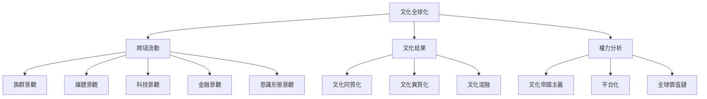

本圖以文化全球化為中心，連結多重跨境流動、文化結果與權力分析。閱讀時先辨認不同景觀，再觀察同質化、異質化與混融如何並存。

```mermaid
flowchart TD
  A[文化全球化] --> B[跨境流動]
  B --> C[族群景觀]
  B --> D[媒體景觀]
  B --> E[科技景觀]
  B --> F[金融景觀]
  B --> G[意識形態景觀]
  A --> H[文化結果]
  H --> I[文化同質化]
  H --> J[文化異質化]
  H --> K[文化混融]
  A --> L[權力分析]
  L --> M[文化帝國主義]
  L --> N[平台化]
  L --> O[全球價值鏈]
```

## 概念連結
* [[文化全球化]]、[[全球化]]、[[族群景觀]]、[[媒體景觀]]、[[科技景觀]]、[[金融景觀]]、[[意識形態景觀]]、[[文化同質化]]、[[文化異質化]]、[[文化混融]]、[[文化帝國主義]]、[[平台化]]、[[全球價值鏈]]
