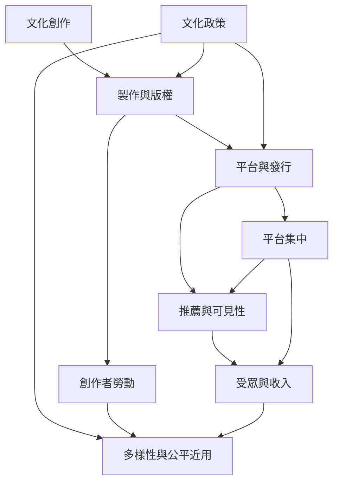

文化產品能否跨國流通、被發現並取得收益，取決於產業鏈、平台治理、國際貿易與公共政策。此圖將市場成長與文化公平分開思考。

```mermaid
flowchart TD
  A[文化創作] --> B[製作與版權]
  B --> C[平台與發行]
  C --> D[推薦與可見性]
  D --> E[受眾與收入]
  B --> F[創作者勞動]
  C --> G[平台集中]
  G --> D
  G --> E
  H[文化政策] --> B
  H --> C
  H --> I[多樣性與公平近用]
  F --> I
  E --> I
```

## 概念連結
* [[文化產業]]、[[創意經濟]]、[[平台化]]、[[全球價值鏈]]、[[文化多樣性]]、[[文化政策應同時保障流通與創作條件]]、[[全球文化市場擴大曝光卻可能集中收益]]
