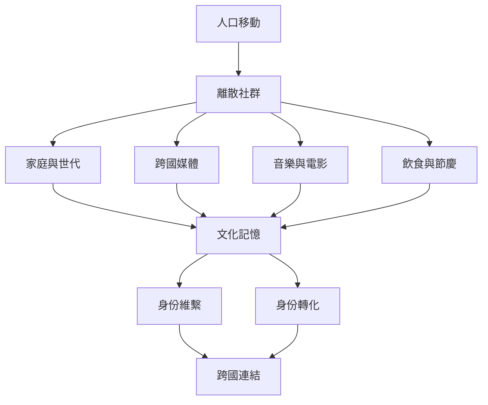

人口移動會帶來跨地生活和多重身份。音樂、電影、飲食與語言讓記憶得以流動，也在新環境中被重構。

```mermaid
flowchart TD
  A[人口移動] --> B[離散社群]
  B --> C[家庭與世代]
  B --> D[跨國媒體]
  B --> E[音樂與電影]
  B --> F[飲食與節慶]
  C --> G[文化記憶]
  D --> G
  E --> G
  F --> G
  G --> H[身份維繫]
  G --> I[身份轉化]
  H --> J[跨國連結]
  I --> J
```

## 概念連結
* [[離散]]、[[跨國主義]]、[[文化記憶]]、[[文化親近性]]、[[離散社群透過文化實踐維繫記憶並創造新認同]]、[[寶萊塢透過離散社群與跨國市場參與重組印度文化身份]]
