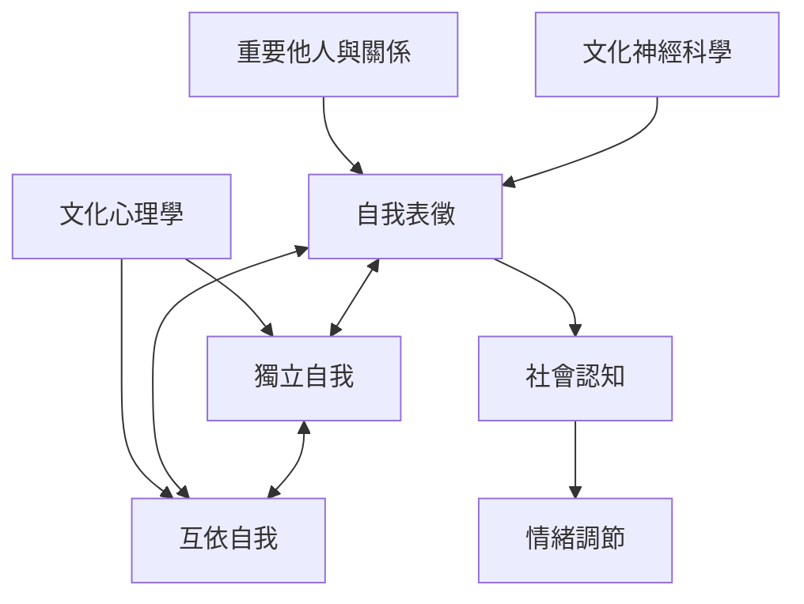

本地圖集中於文化如何影響自我表徵、理解他人與情緒調節。研究焦點不應停留在「個人主義／集體主義」的標籤，而要細看親密關係、角色、情境與具體互動如何進入自我理解。

```mermaid
flowchart TD
  A[文化神經科學] --> B[自我表徵]
  C[獨立自我] <--> D[互依自我]
  B <--> C
  B <--> D
  B --> E[社會認知]
  E --> F[情緒調節]
  G[文化心理學] --> C
  G --> D
  H[重要他人與關係] --> B
```

## 參考
* [[自我是關係網絡中的可塑表徵]]、[[心理與神經差異應在多個層次分別測量]]。
* 概念：[[自我表徵]]、[[獨立自我]]、[[互依自我]]、[[社會神經科學]]、[[情緒調節]]。
