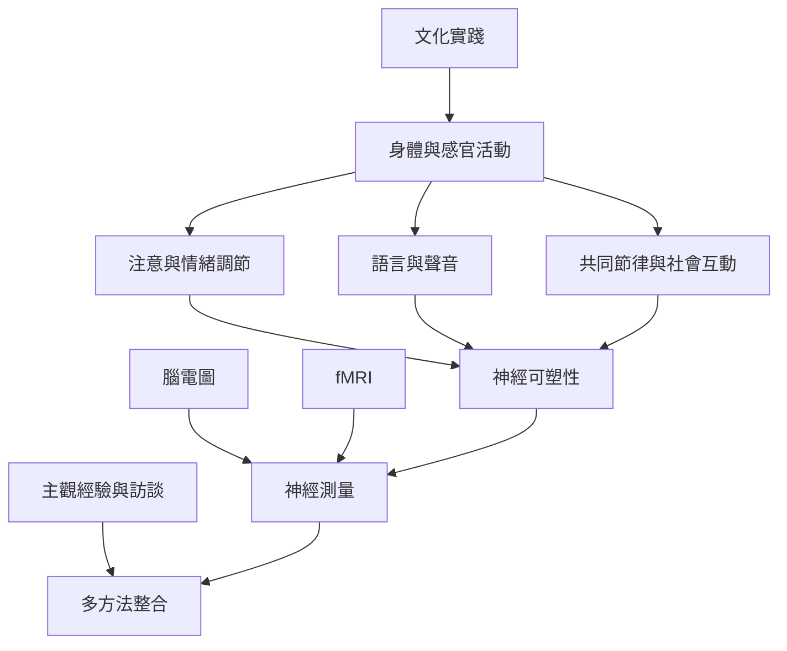

本地圖把語言、吟誦、宗教儀式與其他重複實踐視為身體化的文化學習。重點是把實踐拆解為動作、聲音、呼吸、注意、關係與意義，再討論哪些神經或生理指標適合研究。

```mermaid
flowchart TD
  A[文化實踐] --> B[身體與感官活動]
  B --> C[注意與情緒調節]
  B --> D[語言與聲音]
  B --> E[共同節律與社會互動]
  C --> F[神經可塑性]
  D --> F
  E --> F
  G[腦電圖] --> H[神經測量]
  I[fMRI] --> H
  F --> H
  J[主觀經驗與訪談] --> K[多方法整合]
  H --> K
```

## 參考
* [[身體實踐會留下可研究的神經痕跡]]、[[方法多樣性比單一影像技術更接近整體現象]]。
* 概念：[[神經可塑性]]、[[具身認知]]、[[腦電圖]]、[[fMRI]]、[[吟誦]]。
