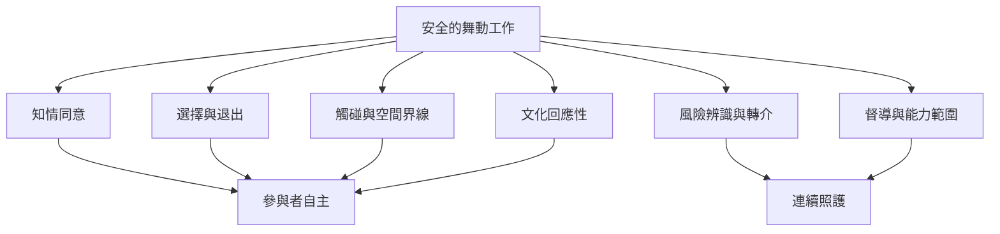

本圖整理DMT與社區舞動工作中不可忽略的安全與倫理元素。治療關係具有不對稱權力，應讓參與者清楚知道活動性質、界線與退出方式。

```mermaid
flowchart TD
  A[安全的舞動工作] --> B[知情同意]
  A --> C[選擇與退出]
  A --> D[觸碰與空間界線]
  A --> E[文化回應性]
  A --> F[風險辨識與轉介]
  A --> G[督導與能力範圍]
  B --> H[參與者自主]
  C --> H
  D --> H
  E --> H
  F --> I[連續照護]
  G --> I
```

延伸概念：[[創傷知情照護]]、[[專業倫理與執業界線]]、[[主體能動性]]、[[文化回應性與文化謙遜]]、[[專業訓練與督導]]。

回到：[[Dance_therapy]]
