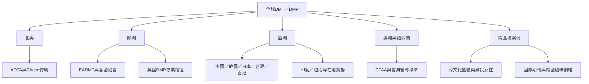

本圖整理可找到專業組織或研究材料的區域。區域標籤是研究入口，不代表每一地的制度成熟度或從業者數量相同。

```mermaid
flowchart TD
  A[全球DMT／DMP] --> B[北美]
  A --> C[歐洲]
  A --> D[亞洲]
  A --> E[澳洲與紐西蘭]
  A --> F[跨區域案例]
  B --> B1[ADTA與Chace傳統]
  C --> C1[EADMT與各國協會]
  C --> C2[英國DMP專業路徑]
  D --> D1[中國／韓國／日本／台灣／香港]
  D --> D2[印度／越南等在地實務]
  E --> E1[DTAA與會員督導標準]
  F --> F1[跨文化團體與難民女性]
  F --> F2[國際期刊與跨國編輯網絡]
```

延伸概念：[[亞洲的專業發展並非單一路徑]]、[[文化回應性與文化謙遜]]、[[專業訓練與督導]]。

回到：[[Dance_therapy]]
