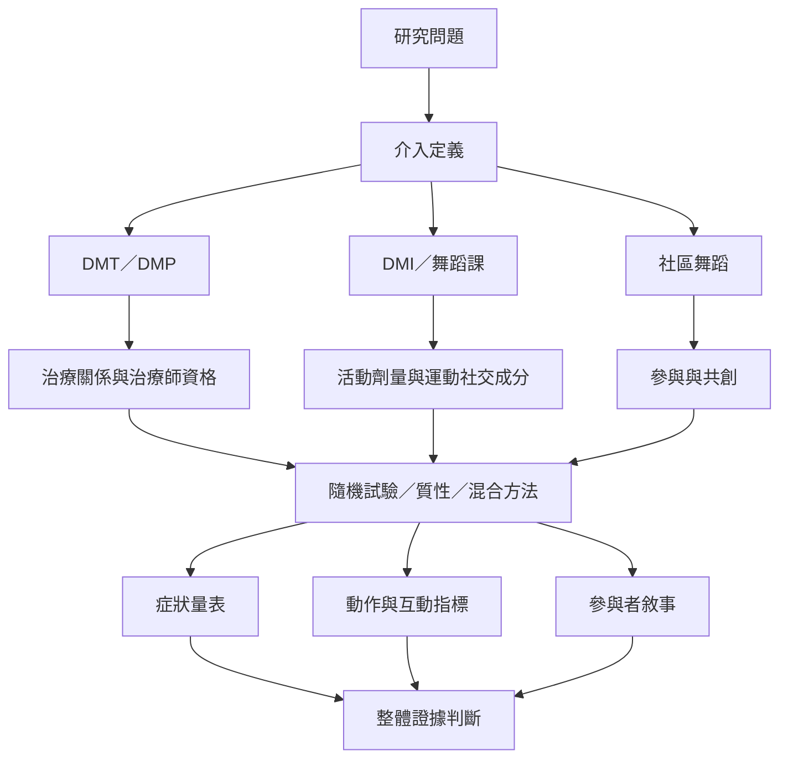

本圖把研究證據分成介入分類、研究設計、成果測量與解讀限制。核心提醒是：不能把DMT、舞蹈運動課與社區舞蹈的效果直接合併成同一結論。

```mermaid
flowchart TD
  A[研究問題] --> B[介入定義]
  B --> C[DMT／DMP]
  B --> D[DMI／舞蹈課]
  B --> E[社區舞蹈]
  C --> F[治療關係與治療師資格]
  D --> G[活動劑量與運動社交成分]
  E --> H[參與與共創]
  F --> I[隨機試驗／質性／混合方法]
  G --> I
  H --> I
  I --> J[症狀量表]
  I --> K[動作與互動指標]
  I --> L[參與者敘事]
  J --> M[整體證據判斷]
  K --> M
  L --> M
```

延伸概念：[[研究方法]]、[[動作敏感的成果測量仍然不足]]、[[研究設計必須描述介入的真正內容]]、[[神經機制應由可觀察的治療過程支持]]。

回到：[[Dance_therapy]]
