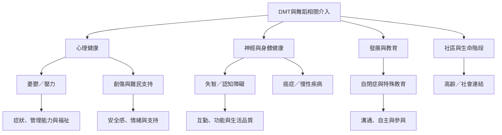

DMT研究涵蓋不同年齡、健康狀態與服務場域，但每一族群的介入目標及證據品質都不同。此圖是領域索引，不代表所有族群都已有確定療效。

```mermaid
flowchart TD
  A[DMT與舞蹈相關介入] --> B[心理健康]
  A --> C[神經與身體健康]
  A --> D[發展與教育]
  A --> E[社區與生命階段]
  B --> B1[憂鬱／壓力]
  B --> B2[創傷與難民支持]
  C --> C1[失智／認知障礙]
  C --> C2[癌症／慢性疾病]
  D --> D1[自閉症與特殊教育]
  E --> E1[高齡／社會連結]
  B1 --> F[症狀、管理能力與福祉]
  B2 --> G[安全感、情緒與支持]
  C1 --> H[互動、功能與生活品質]
  D1 --> I[溝通、自主與參與]
```

延伸概念：[[成果應同時衡量症狀與生活能力]]、[[高齡者的舞動介入需要區分復健與心理治療]]、[[創傷知情照護]]、[[身體差異與參與者自主應優先於動作矯正]]。

回到：[[Dance_therapy]]
