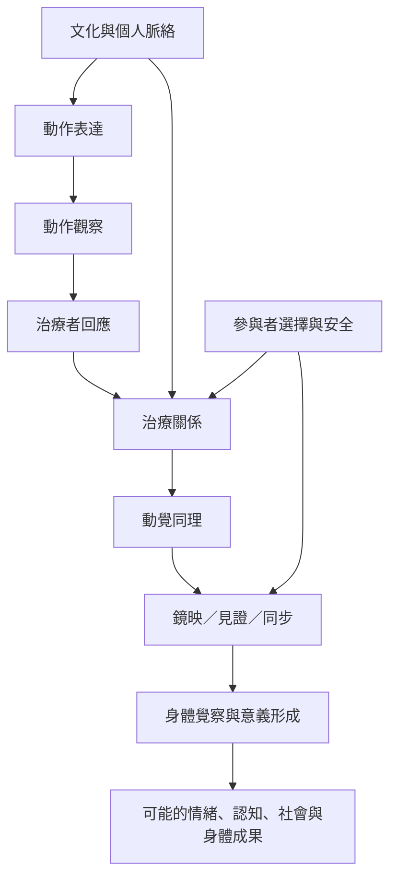

本圖把DMT中的可能歷程分成動作表達、治療關係、身體覺察與互動過程。它是概念模型，不是已被驗證的單一路徑因果模型。

```mermaid
flowchart TD
  A[動作表達] --> B[動作觀察]
  B --> C[治療者回應]
  C --> D[治療關係]
  D --> E[動覺同理]
  E --> F[鏡映／見證／同步]
  F --> G[身體覺察與意義形成]
  G --> H[可能的情緒、認知、社會與身體成果]
  I[文化與個人脈絡] --> A
  I --> D
  J[參與者選擇與安全] --> D
  J --> F
```

延伸概念：[[動覺同理]]、[[鏡映]]、[[人際同步]]、[[見證與陪伴]]、[[具身認知]]、[[內感受]]、[[身體覺察]]、[[治療關係]]、[[主體能動性]]。

回到：[[Dance_therapy]]
