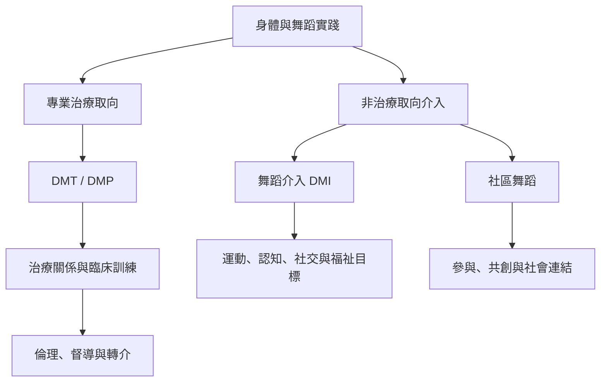

本圖整理DMT/DMP、一般舞蹈介入與社區舞蹈之間的關係，並連結專業定義、地區制度與倫理界線。此分類是閱讀工具，不代表各地法規均採相同分界。

```mermaid
flowchart TD
  A[身體與舞蹈實踐] --> B[專業治療取向]
  A --> C[非治療取向介入]
  B --> D[DMT / DMP]
  C --> E[舞蹈介入 DMI]
  C --> F[社區舞蹈]
  D --> G[治療關係與臨床訓練]
  E --> H[運動、認知、社交與福祉目標]
  F --> I[參與、共創與社會連結]
  G --> J[倫理、督導與轉介]
```

延伸概念：[[舞蹈動作治療]]、[[舞蹈動作心理治療]]、[[舞蹈介入]]、[[社區舞蹈]]、[[治療關係]]、[[專業訓練與督導]]、[[專業倫理與執業界線]]。

回到：[[Dance_therapy]]
