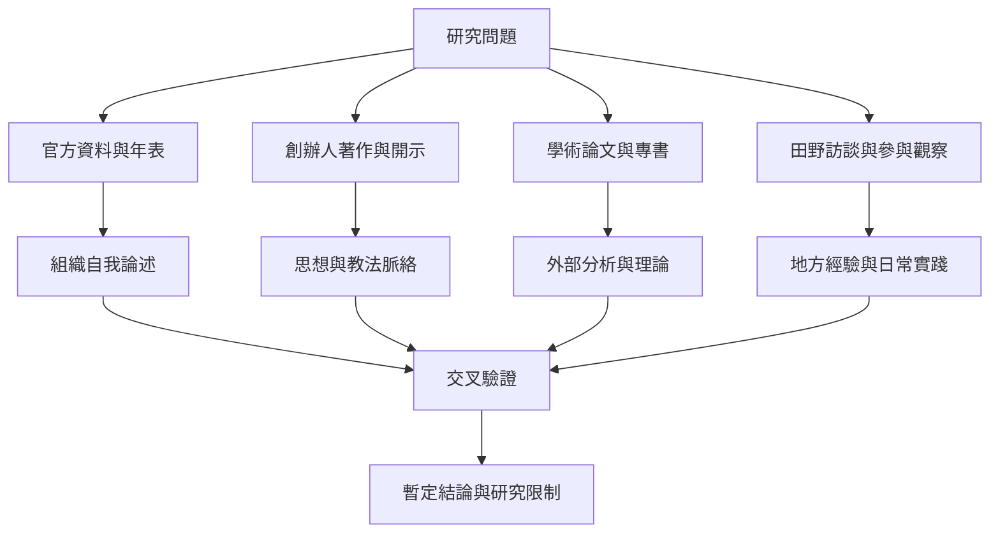

研究法鼓山應將一手組織資料、創辦人著作、學術研究、論文、田野訪談與參與者經驗分層處理。官方資料適合理解組織自我定位及確認活動沿革；學術著作與論文有助分析歷史、思想和制度；訪談與觀察能呈現實際宗教生活；環境或社會影響則需要可檢驗的資料。不同來源互補，不能互相取代。

```mermaid
flowchart TD
 A[研究問題] --> B[官方資料與年表]
 A --> C[創辦人著作與開示]
 A --> D[學術論文與專書]
 A --> E[田野訪談與參與觀察]
 B --> F[組織自我論述]
 C --> G[思想與教法脈絡]
 D --> H[外部分析與理論]
 E --> I[地方經驗與日常實踐]
 F --> J[交叉驗證]
 G --> J
 H --> J
 I --> J
 J --> K[暫定結論與研究限制]
```

概念連結：[[佛教教育]]、[[佛教現代主義]]、[[宗教組織傳承]]、[[跨國佛教]]、[[佛教環境倫理]]。
